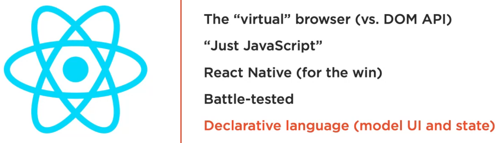

## Things to know before learning React

**Try to learn this way**


## Why React?
- **Library not framework:** React is a JS library.
- **Small not a complete solution:** 
  - React is small but not a complete solution.
  - We need other libraries to form solution.
- **Focuses on only one thing:**
  - React focuses on only one thing that is building user interfaces(UI).
  - An UI is anything we put in front of users to have them interact with a machine.
  - UI is everywhere, from the simple buttons on a microwave to the dashboard of a space shuttle.
  - If the device we are trying to interface can understand JS, we can use React to describe a UI for it.
- **Web user interface:**
  
  - Since web browser understand react, we can use React to describe web user interfaces.
  - We like the word `describe` here because that is what we basically do with React.
  - We just tell react What we want, and it will build the actual UI on behalf of the web browser.
  - Without react or similar libraries we would need to manually build user interfaces with native web APIs in JS.
- **Declarative:**
  
  - React is declarative. We describe UI with React and tell it what we want, not how to do it.
  - React will take care of the how and translate our declarative descriptions, which we write in the React language to actual UI in the browser.
  - **Isn't HTML Already declarative?**
    
    - HTML itself is a declarative language, but with React, we get to be declarative for HTML interfaces that represent dynamic data, not just static content.

## How exctly is not being a framework a good thing?
- **Great for startups:**
  - Frameworks serve a great purpose, especially for young teams and startups.
  - When working with a framework, many smart design decisions are already made for us.
  - Which gives us a clear path to focus on writing good application-level logic.
- **Disadvantages**
  
  - However frameworks come with some disadvantages as well. For experienced developers working on large codebases, these advantages are sometimes a deal breaker.
  - **Limited flexiblity:** 
    - Frameworks are not flexible, although some claim to be. Frameworks want us to be code everything in a certain way.
    - If we want to deviate from that way, the framwork ends up fighting us about it.
  - **Large and full of features:**
    - Which makes them hard to customize for specialized cases.
    - If we need to use only a small piece of a framework, we usually have to include the whole thing.
    - This is changing today, but it is still not ideal.
  - **Unique philosophy:**
    
    - React follows this one of UNIX's unique philosophy.
     
    - Because it is a small library that focuses on just one thing, enabling developers to declaratively describe their user interfaces and model the state of these interfaces.

## Why React is so popular?


- **The virtual browser**
  - Working with the DOM API is hard. 
  - React Basically gives developers the ability to work with a virtual browser that is friendlier than real browser.
  - The virtual DOM performace is certainly a nice plus. However developers like it more because they wouldn't need to deal with the DOM API.
- **Just JavaScript**
  - Even though some people don't like the second option, but React is just JavaScript.
  - That means there is a very small React API to learn, and after that our JS skills are what make us better React developer.
- **React Native**
  - React Native allows us to use the same React skills to build native mobile applications.
  - We can even share some logic between our web iOS and Android applications.
- **Battle tested**
  - The React team at facebook tests all imporvements and new featues that get introduced to React right there on facebook.com which increases the trust in this library among the community.
- **Declarative language(model, UI and state)**
  - React declaratively describe stateful user interfaces. It's the most important one.
  - This mean instead of coming up with steps for the transactions on their interfaces, developers just describe the interfaces in terms of a final state, like a function.
  - When transaction happens to that state, React takes care of updating the user interfaces based on that.

## React's Basic Concepts

- React has three simple and fundamental concepts that we need to understand.
- **1. Components**
  - **Like functions**
    - With React we describe user interfaces using components.
    - We can really think of components as functions.
    - Infact simple react components are just vanilla JavaScript functions.
  - **Input: props, state | Output: UI**
    - In any programming languages, we invoke functions with some input, and they give us some output in return.
    - We can reuse functions as needed and compose bigger functions from smaller ones. 
    - React components are exactly the same. They receieve certain input objects, and they output a description of a user interface.
  - **Reusable and composable**
    - We can reuse a single component in mulitple user interfaces, and components can contain other components.
  - **`<Component/>`**
    - However we don't really invoke a React component.
    - We just use it in our HTML as if it was just a regular HTML element.
  - **Can manage a private state**
    - Also unlike pure functions, a React component can have a private state to hold any data that may change over the lifecycle of the component.
- **2. Reactive updates**
  - **React will react and Take updates to the browser**
    - React will simply react to the changes in a component's state and automatically update the parts of the DOM that need to be updated.
- **3. Virtual views in memory**
  - **Generate HTML using JavaScript**
    - To build HTML web applications with React, we don't write HTML at all.
    - We use Javascript to generate HTML.
  - **No HTML template language**
    - React embraces the latter one and eliminates the extra step needed to parse and enhance the HTML template.
    - HTML in JS enables React to keep and use a virtual representation of HTML views in memory, which is commonly known as virtual DOM or **tree reconcilliation algorithm**.
  - **Tree reconcilliation**
    - React uses the virtual DOM to compare versions of the UI in memory before it acts on them.

## React Components


- A React component can be either `Function Component` or `Class Component`. **Both types can be statefull and have side effects, or they can be purly presentational**.
- Most of the time we prefer function components over class components becuase they are really much simpler.
- `Class component` is a bit more powerful.
- Both types can be compared to regular functions when it comes to their contract.
- They use a set of props and state as their input, and they output what looks like HTML.
-  But is really a special JavaScript syntax called JSX. 
-  **Props and State**
   -  The `props` input is an explicit one. It is similar to the list of attributes an HTML element can have.
   -  **The `state` input is an internal one**. But it is really the more interesting one because of how React uses it to auto-reflect changes in the browser.
   -  These two input objects have one important difference. **Within a component the state object can be changed while the props object represents fixed values.**
   -  **Props are immutable. Components can only change their internal state, not their properties. This is a core idea to understand in React.**

## JSX is not HTML

- This is a simple react class component without any input, so no props or state and with a simple h1 in a div output.
- **On the left side**, the component is written in the special JSX syntax. 
- We already stated earlier that we don't write HTML at all in react, and instead we use React API to generate our views.
- **In a way this JSX syntax we see on the left is the compromise to that rule.** It makes our task of using the React API as close as possible to writing HTML, but it is not HTML. It simply gets compiled to the pure JavaScript calls that we see here on the right.
- **React.createElement:** This element calls that we see on the right are what we shipt to browsers. They are the JavaScript representation of this component's DOM and they are what React can efficiently translate into actual DOM operations to be performed by the browser.

## Our first react component
- We consider the website `https://jscomplete.com/playground` for practicing. Here `React` and `ReactDOM` is already preloaded.
- We run this command in the online editor
  ```javascript
    function Hello() {
    return <div> Hello React! </div> // React.createElement('div', null, 'Hello React!')
  }

  ReactDOM.render(
  <Hello />, // React.createElement(Hello, null)
    document.getElementById('mountNode')
  );
  ```
- **URL reference: `jsdrops.com/rgs1.1`**
- Here the `Hello` component has no input, state or props.
- **ReactDOM.render():**
  - To display the React DOM in the browser, we need to instruct the ReactDOM library on how to do that.
  - The function designed to do that is ReactDOM.render, which takes in two arguments.
  - First is the function to render. In our case it's the `<Hello/>` component.
  - The second argument to the `ReactDOM.render()` function is the DOM element in the browser where we wish the React component to show up.
- **`document.getElementById('mountNode')` can be treated as the entry point for React. We are telling React to take over this element and render all of the content within it.**
- **Questions:** 
  - What is going on here on line 131 `return <div>Hello React! </div>`?
  - How are we writing HTML inside a Javascript function?
  - And why is this working and not throwing any error?
- **Answers**
  - We are creating a component using JSX.
  - We are writing using JSX syntax which is going to be transpailed using Bable for creating HTML element in the Main DOM using Reacts virtual DOM.
     
  - This is JSX code, not JS. So if we want to run directly from javascript environment without React support it will fail to run. `Babel` compiler is used to convert JSX into React API calls. We can run this code in `babeljs.io/repl`.
  - **We write what looks like HTML and Babel coverts into React API calls.** 
- **Convesion:** 
    ```javascript
    return <div>Hello React!</div>
    ``` 
    is coverted to the below one using React API.
    ```javascript
    return React.createElement('div', null, 'Hello React!')
    ``` 
    - `React.createElement()` can take many arguments. Here the **First argument is the element to be created. In this case, a div**.
    - **Second argument is any attributes this element will have**. In this case it has no attributes.
    - **Third argument is the child of that div element.** In our case, it's just the string  `Hello React!`.

## Our First React Hook
  **URL reference: `jsdrops.com/rgs1.2`**
  ```javascript
  function Button() {
  return <button> Hello React! </button> 
  }

  ReactDOM.render(
  <Hello />,
    document.getElementById('mountNode')
  );
  ```

- Our component currently rendering a stateless button. We now need to make the button increment a counter every time it's clicked.
- **`useState()`:**
  - To use a state object, react has a special function named `useState()`.
  - This `useState()` function is going to return two items for us:
    - **state object(getter): counter**
    - **updater function(setter): setCounter**
  - The State object can be of any time we wish it to be. It could be a string, a number, or any array, or anything else.
  ```javascript
  function Button() {
    const [counter, setCounter] = useState(0)
    return <button> Hello React! </button> 
  }

  ReactDOM.render(
  <Hello />,
    document.getElementById('mountNode')
  );
  ``` 
  - We use array destructuring in the `useState()` function. Here `useState()` returns two elements and we destructure these two elements into two variables in our Button component.
  - The argument to `useState()` is the intial value for the state element `counter`.
  - As we want the `counter` as number we set that to `0`.
  -  
  We can use any javascript expression inside the curly brace. Here we used `Math.random()` as an example.
  - To achieve our goal we will pass `counter` in the curly brace.
  - To use the `setCounter` updater function, every time we click on this button, we need to introduce an event handler.
   
  
  - **onClick:** We define an `onClick` attribute on the button element. This `onClick` attribute is also case sensitive. So it has to be camel case.
     
    - This react `onClick` attribute receives a function reference. So we always specify that inside our curly braces as well.
    - Here we are going to specify a function reference name `logRandom()`
    - Now if we open the browser console and click on the button, every time a random value will be displayed.
       
    - Here in the `onClick` we just have to provide the function name not the `()`. 
     
    - We could also inline the function defination which will also work.
      
    - we could also use arrow function. That's how we wire onclick event.
- To make the counter count we need to use the `setCounter` updater function that we got from `useState`.
  ```javascript
  function Button() {
    const [counter, setCounter] = useState(0)
    return <button onClick={() => setCounter(counter+1)}> {counter}</button> 
  }

  ReactDOM.render(
  <Hello />,
    document.getElementById('mountNode')
  );
  ```
- **This `useState` function is called a hook in the react world. It is similar to a mix-in or module. But it is a stateful one that hooks this simple component into a state.**
- Here we did not implment any transactions in the UI. We implmented the transaction on a JavaScript counter object in memory.
- Our UI implementation was basically telling React that we want the label of the button to always reflect the value of that counter object.
- We did not do any DOM updates, React did.
- **Challenge: Start the react button with initial label value 5 and double that value on each click. The solution is provided here: `jsdrops.com/rgs1.3`**


## Our First One way Data Flow
```javascript
function Button() {
const [counter, setCounter] = useState(0);
const handleClick = () => setCounter(counter+1);
return (
   <button onClick={handleClick}>{counter}</button>
);
}

ReactDOM.render(
  <Button />, 
  document.getElementById('mountNode'),
);
```
- It's recommended not to use inline long arrow functions. Instead we could create variable `handleClick` to keep the function call.
- We should use parenthesis `()`, while using `return` keyword.
- **We are going to add a button and a display component. After clicking the button, the increment will be displayed.**
- While adding function element in the `React.render()` we can add elements in number of ways:
  - Adding as a list: `[<Button/>, <Display/>]`. This is a good solution when all the elements we are rendering are coming from the same components in a dynamic way.
  - Adding in a making these two react element children of another react element:
    ```javascript
    <div>
    <Button/>
    <Display/>
    </div>
    ```
  - **React.Fragment:** 
    - We can keep elements inside `React.Fragment` like this:
      ```javascript
      <React.Fragment>
      <Button/>
      <Display/>
      </React.Fragment>
      ``` 
    - This case is so common in react that the JSX extension has a shortcut for it. Instead of typing `React.Fragment`, we can just have an empty tag like this `<> </>`:
      ```javascript
      <>
      <Button/>
      <Display/>
      </>
      ```
    - This `<></>` will be converted to `React.Fragment` version in the proper environment.

- If we add this way `<Button/> <Display/>`, it won't work. Because each one of these elements gets translated into a function call.
- At this time we can consider like this:
  ```javascript
  function Button() {
  const [counter, setCounter] = useState(0);
  const handleClick = () => setCounter(counter+1);
  return (
     <button onClick={handleClick}>{counter}</button>
  );
  }

  function Display() {
    return (
      <div>....</div>
    )
  }

  ReactDOM.render(
    <div>
    <Button />
    <Display />
  </div> ,
    document.getElementById('mountNode'),
  );
  ```
- The above code can be optimized like this:
  ```javascript
  function Button() {
  const [counter, setCounter] = useState(0);
  const handleClick = () => setCounter(counter+1);
  return (
     <button onClick={handleClick}>{counter}</button>
  );
  }

  function Display() {
    return (
      <div>....</div>
    )
  }

  function App() {
    return (
      <div>
      <Button>
      </Display>
      </div>
    )
  }

  ReactDOM.render(
    <App/>,
    document.getElementById('mountNode'),
  );
  ```
    - But we two problems here. Firstly, `useState(0)` hook is only accessible for `Button()` component. It is not available outside.
    - To solve this issue we can cut it to the `App()` component.
    - Another problem is we need to pass the value of `counter` variable to the `Display()` component.
    - We can pass a props named `message` to the `Display()` component, just like an HTML attribute in `<Display message = {counter}/>` component. 
    - **One way Data Flow:** 
      - In the `Display(props)` component we catch the value as `{props.message}`. What we did here is called the one-way flow of data. 
      - Parent component can flow their data down to children components. Parent components can also flow down behavior(method or function) to their children.
      - `props` can also hold functions as well, not just data. Functions are just objects in Javascript. And we can pass any object value as `props`.
      - So we create a variable in `App()` component like this `const incrementCounter = () => setCounter(counter+1)`. Then we pass it to the `Button(props.onClickFunction)` component from `App()` component like this `<Button onClickFunction={incrementCounter}/>`
- So the final version of the code is
  ```javascript
  function Button(props) {
    return (
      <button onClick={props.onClickFunction}>+1</button>
    );
  }

  function Display(props) {
    return (
      <div>{props.message}</div>
    )
  }

  function App() {
    const [counter, setCounter] = useState(0);
    const incrementCounter = () => setCounter(counter+1);
    return (
      <div>
        <Button onClickFunction={incrementCounter}/>
        <Display message={counter}/>
      </div>
    );
  }
  ReactDOM.render(
    <App/> ,
    document.getElementById('mountNode'),
  );
  ```
- **Concept of Responsibility isolation:**
  - It seems like the `Button()` component reaches out to the App component and says hey parent, go ahead and invoke that `incrementCounter` behavior now.
  - In reality the `App()` component is the one in control here, and the `Button()` component is just following generic rules.
  - Here `Button()` component has no clue what happens when it gets clicked. It just follows the rules defined by the parent and invokes a generic onClick function.
  - This is basically **the concept of responsibility isolation**.
  - Each component here has certain responsibilities, and they got to focus on that.
    - This `App()` component has the responsibilty of managing the counter state.
    - `Display()` component is responsible for displaying increments only.

## Components Reusability
- One of the selling point about components is reusability.
- Making a component generic enough so that we can reuse it in different cases. (URL link: `jsdrops.com/rgs1.5`)
- Here we are willing to make our `Button()` component more generic(URL link: `jsdrops.com/rgs1.6`). We are going increment the button value and behavior and it follows like this:
  ```javascript
  function Button(props) {
  const handleClick = () => props.onClickFunction(props.increment)
  return (
    <button onClick={handleClick}>+{props.increment}</button>
  );
  }

  function Display(props) {
    return (
      <div>{props.message}</div>
    )
  }

  function App() {
    const [counter, setCounter] = useState(0);
    const incrementCounter = (incrementValue) => setCounter(counter+incrementValue);
    return (
      <div>
        <Button onClickFunction={incrementCounter} increment={1}/>
        <Button onClickFunction={incrementCounter} increment={5}/>
        <Button onClickFunction={incrementCounter} increment={10}/>
        <Button onClickFunction={incrementCounter} increment={100}/>
        <Display message={counter}/>
      </div>
    );
  }
  ReactDOM.render(
    <App/> ,
    document.getElementById('mountNode'),
  );
  ```  

## Tree Reconciliation in Action
- URL link: `jsdrops.com/rgs1.7`
- Intial impressions can be 
  - **Why go for all this trouble?**
  - **Why use Javascript to generate HTML?**
  - **What exactly is the value I am getting from doing all that?**
- **Let's create a `div` element using both DOM API and React API (which in turns uses the DOM API)**.
  ```javascript
  // Manipulating DOM
  document.getElementById('mountNode').innerHTML =`<div>Hello HTML</div>`;

  // Implementing React API
  ReactDOM.render(
    React.createElement("div", null, "Hello React"),
    document.getElementById('mountNode2')
  );
  ```
  - The only difference between two nodes is that 
    - in the HTML version, we used a string to represent the content. 
    - While in the React version, we used pure JS calls and represented the content with an object instead of string.
  - Here did not use any JSX.
- **Let's add an input element here. We will this change using both DOM API and React API. We will also add current date and time.**
  ```javascript
    // Manipulating DOM
  document.getElementById('mountNode').innerHTML =`
    <div>
      Hello HTML
      <input />
      <pre>${(new Date).toLocaleTimeString()}</pre>
    </div>
  `;

  // Implementing React API
  ReactDOM.render(
    React.createElement(
      "div", 
      null, 
      "Hello React",
      React.createElement('input', null),
      React.createElement('pre', null, (new Date).toLocaleTimeString()),
    ),
    document.getElementById('mountNode2')
  );
  ```
    - **Both the HTML and React versions are still rendering the exact same HTML in the browser. But as we can see React way is lot more complecated that the native DOM way.**
    - **So we have an important question to ask why go for all this trouble?**
    - **What is it that React does so well that is worth giving up the familiar HTML and having to learn a new API to write what can be simply written in HTML?**
    - **The answer is not about rendering first HTML view, it's about what we need to do to update any existing views in the DOM.**
    - **So let's do an update operation. Let's simply make the timestamp tick every second. We can easily repeat a javascript call in the browser using the `setInterval(fn,duration)` web timer API.**
  ```javascript
  const render = () => {
  document.getElementById('mountNode').innerHTML =`
  <div>
    Hello HTML
    <input />
    <pre>${(new Date).toLocaleTimeString()}</pre>
  </div>
  `;

  // Implementing React API
  ReactDOM.render(
  React.createElement(
    "div", 
    null, 
    "Hello React",
    React.createElement('input', null),
    React.createElement('pre', null, (new Date).toLocaleTimeString()),
  ),
  document.getElementById('mountNode2')
  );
  }

  setInterval(render, 1000);
  ```
    
    - Although the whole React rendering code is within our ticking timer,  
    - Here if we try to type something in the text box of the HTML version, we will not be able to able to keep it. This is very much expected because we are basically throwing away the whole DOM node on every tick and regenerating it.
    - However if we try to type and keep something in the text box that is rendered with React, we can certainly do that.
    - Although the whole React rendering code is within our ticking timer, React is changing only the timestamp text and not the whole DOM node.
    
    - This is why the text input was not regenerated and we were able to type in it. We can see in the chrome dev tools highlight any DOM elements that get udpated.
    - **We can see how we are regenerating the entire first `mountNode` element with every tick, while React is smartly only regenerating the content of the pre element in the second mountNode. This is React's smart diffing algorithm in action.**
    - **It only regenerates in its DOM node what actually needs to be regenerated, while it keeps everything else the same.**
    - **This diffing process is possible because of React's virtual DOM and the fact that we have a representation of our user interface in memory because we wrote it in JavaScript.**
    - **For every tick in this example, React keeps the last UI version in memory, and when it has a new one to take to the browser, that new UI version will also be in memory.**
    - **So React can compute the difference between the new and the old versions. In this example, the difference was the content of the pre element.**
    - **React will then instruct the browser to update only the computed diff and not the whole DOM node. No matter how many times we regenerate our interface, React will take to the browser only the new partial updates.**
    - Note that the HTML version can be easily changed with a few more lines to make it update only the content of the pre element as well instead of the whole thing. But that requires some imperative programming. We are not doing in React. We are being declarative in React.
    - We just told React that we'd like a pre element with the date string. No imperative logic is here, and yet we're still getting the efficiency of a tuned-up imperative alternative. This is the subtle power here.
    - React way is not only efficient but also removes a big layer of complexity about the way we think about updating the User interfaces.
    - Having React do all the computations about whether we should or should not update the DOM enables us to focus on thinking about our data and state and the way to model that state.
    - We then only manage the udpates that's needed on the state without worrying about the steps needed to reflect these updates in the actual UI in the browser because we know React will do exactly that for us, and it will do it in an efficient way.

## Wrap up

- **Components and reactive updates**
  - A React application is a set of reusable components. Components are just like functions. They take input and they output a description of a user interface in the form of a React element.
- **Virtual DOM nodes and JSX**
  - The ReactDOM library enables us to render those React elements in the browser, and it will rerender for us automatically when their in memory state changes.
  - To accomplish this we write the component's markup using the React JavaScript API.
  - Writing HTML in javascript is a lot different that what we're used to. But lucky React has a syntax very close to the HTML syntax we're used to.
  - This special React syntax is called JSX. Once we have the virtual DOM syntax in JSX, we can pre-transform it to valid React API calls, before shipping it to the browser.
  - Browser don't have to deal with JSX.
- **Props and State**
  - The input for a component is a set of properties we can access inside the component with it's first argument object, which is usually named props.
  - And also a set of state elements that a component can hook into with the special `useState` function.
  - A component state can be changed inside that component. And every time a component changes its state, React rerenders it.
  - The props of a component can not be changed by the component, but the whole component can be rerendered with different props by component's parent.
- **ReactDOM.render**
  - The syntax to mount a React component in the browser is `ReactDOM.render`, and that takes two arguments, the component to render and the HTML element to hold the React-rendered markup.
- **React events(onClick, onSubmit, ...)**
  - React also comes with normalized events that work across all browsers in a standard way.
  - We have seen the `onClickEvent` handler in this course module, and there are other `onSomething` events like `onChange` and `onSubmit` and many others.
- **Functions and class components**
  - React actually has two types of components, function and class components.